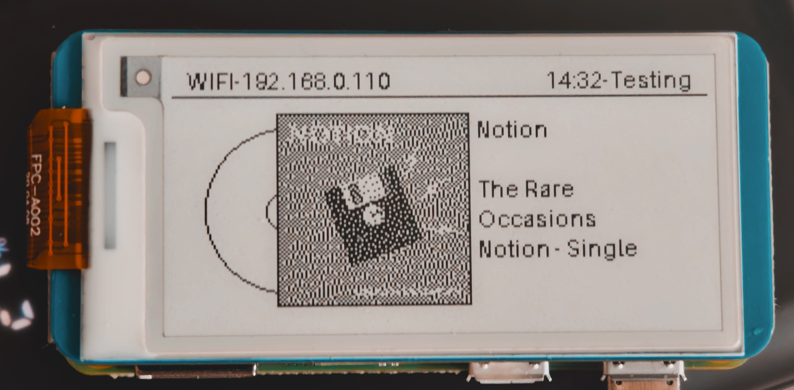

<h1 style="font-size:50px">Canto</h1>

A 24/7 song identifier using a e-ink screen and a Pi Zero WH as the client

**This project is in beta! I am still currently getting it all to work.**

@Finbear2 2026

## What is it?

Canto is a 24/7 music identification service using shazamIO API for song identification on a backend server with all recording being done on a pi zero wh connected to a waveshare 2.13 inch black and white e-ink screen to allow the user to see the most recently identified songs and the currently playing songs. It uses the server setup as shazamio requires dependeancies that don't run well on the pi zero w hardware and it was just a pain to setup.

This is basically a 24/7 shazam that lives inside your pocket.

## Features

- Identifies songs
  - Viewable from 24/7 web UI
- Stores offline queue
- Bluetooth tether (Maybe... Maybe...)
- Displays cute album art on screen

## Images

**Some images are outdated as I've switched to a faster and much better algorithm... just .convert("1") but it's better**

## Setup

At the moment I'm still working on this but in the future

## Hardware

Musts:

- 2.13inch waveshare e-ink bw hat

Interchangeable:

- Pi Zero WH (Can be anything with compatible GPIO headers to the screen that can run linux)
- Pi 400 (Anything that can run a python script e.g. laptop, desktop, random old computer, pi>=pi4 )
